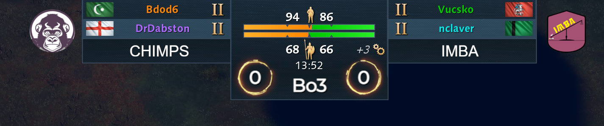
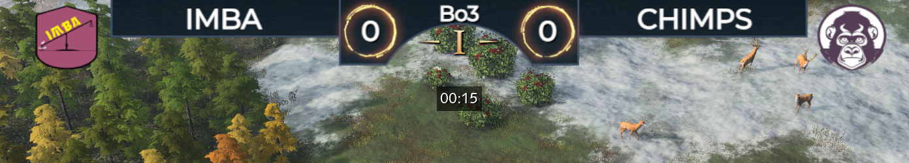

# AoE4-Stream-Manager

NodeCG Based project to manage Rising Empires our Age of Empires 4 Streams.

### Features

- Civ Draft Graphic
  - Show banned and picked civs
  - Player or Team names (Can be shown in 2v2 Graphic)
  - Import Draft from aoe2cm.net for easy managing
- Map display
  - Show up to 9 maps as a graphic
- Caster Manager
  - Very simple text to showcase who is casting
- Series Score Graphics
  - Extends Ingame Overlay to include a Score to show a Series Score
  - Minimap overlay to hide Playback Controls to prevent spoilers
  - "API"/HTTP Endpoints for StreamDeck usage
- 2v2/Team Game Graphics
  - Graphics for Ingame for Kusch's Improved Observer UI mod
  - Graphics for Default UI
  - Show Team Icons
- Very simple Countdown Timer

##### Civ Draft

The Civ Draft Module allows you too have a seperate screen to show the draft.
Drafts can be manually edited or;
Import finished drafts from aoe2cm.net. Sniped civs shows as banned on the opponents side. This is planned to be changed to better showcase the real draft.
Currently only a few presets are supported.
2v2 (and 3v3 & 4v4, although graphic might break or look weird) is supported to be used in our 2v2 Rising Empires League.

##### Map Display

Map Display is not fully implemented yet, but can be extended to show up to 9 maps in a line. The map in the middle is from this module.
New maps can easily be added or edited via the Assets tab from the browser.

Importing Map Draft from aoe2cm.net is on our Todo list, as well as adding a proper map draft to showcase who has home map. And what maps was won in a series.

##### Series Score

Adds a toggleable Graphic for displaying the series score and play amount(?)
Has fancy circles and "Between text" manually editable to be whatever. (Bo3, Pa3, Bo9, Moo, w.e)
Has an "API" or GET Endpoints for use with StreamDeck i.e.
Includes a toggleable "Spoiler Overlay" which hides the Playback Controls under the minimap in Caster Mode. As the Speed Up button gets highlighted when a game ends when spectating live.

|  |
| :-------------------------------------------------------------: |
|                         *1v1 Overlay*                         |

There is also support for team games, both with Kusch's Improver Observer UI & without the mod. In team games you have the option to show Team Icons if applicable.

|  |
| :-------------------------------------------------------------------------------: |
|                     *Team Games with Improved Observer UI*                     |

|  |
| :-----------------------------------------------------------------------------------: |
|                            *Team Games with Default UI*                            |

In the future we want to copy some features from Kusch's Observer UI. Mainly showcasing at the top which Civ is being played by whom.

##### API / HTTP Endpoints

| Endpoint                     | Function                            |
| ---------------------------- | ----------------------------------- |
| `GET /score/toggleScore`   | Toggles the Score Graphics          |
| `GET /score/toggleSpoiler` | Toggles the Minimap/Spoiler Overlay |
| `GET /score/addLeft`       | Adds 1 to the Left Side Score       |
| `GET /score/addRight`      | Adds 1 to the Right Side Score      |
| `GET /score/swapScore`     | Swaps the Left and Right Score      |

##### Caster Manager

So you can edit casters name plate here instead of OBS. Yea thats it...

# Installation

For now; Contact @anmagicalcow on Discord or Twitter for free hosting/demo of the tool
You can also make the Dockerfile yourself, although there is some issues with not having a prefilled Database breaking some of the dashboards

### Todo

- ~~Integrate Aoe2cm Draft~~ (WebSockets or API) (API Done)
  - Add WebSockets for live drafts?
  - Add option to import names from aoe2cm aswell. Although not reliable name source since can be random things. And not very useful for Team Games
- 2v2 Default UI
  - Add which player is playing which Civ similiar to Improved Observer UI
- Show maps
  - Select Winner/Loser for map to overlay
  - Change to be per side?
    - Home maps, current played map in middle, etc
- Add Twitch Prediction integration
  - Create prediction based on who is playing from Aoe-4-civ-draft. Allow closing it too?
